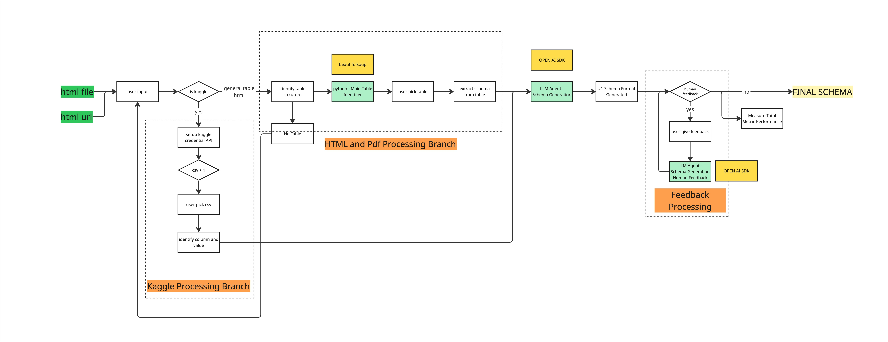

# HTML to Data Schema Converter for InterChat

**[MILESTONE 3 ASSIGNMENT - AI PM COURSE, CARNEGIE MELLON UNIVERSITY]**

A specialized tool designed to automatically extract and generate structured data schemas from HTML tables for use with the InterChat visual analytics system.

## Overview

The HTML to Data Schema Converter eliminates a critical barrier to entry for InterChat users by automating the creation of data schemas. InterChat is a powerful generative visual analytics system that requires structured data schemas to function effectively, and this tool bridges the gap by converting HTML tables into these schemas.

This converter uses a multi-agent architecture powered by BeautifulSoup for HTML parsing and Large Language Models for intelligent schema generation, drastically reducing the time and technical knowledge required to prepare data for InterChat.

## Refined Workflow Architecture

In milestone 3, we have refined our approach with an enhanced workflow that better handles multiple input sources and processing paths:



### Key Workflow Improvements

Our refined architecture now features:

1. **Dual Processing Branches**
   - HTML Processing Branch: Handles direct HTML inputs from files or URLs
   - Kaggle Processing Branch: Specialized pathway for working with Kaggle datasets

2. **Intelligent Table Selection**
   - LLM Agent now assists in identifying the most relevant table when multiple tables are present
   - User can verify and select the appropriate table for processing

3. **Enhanced Schema Generation**
   - Two-path schema generation based on available data:
     - Schema Generator 1: Processes tables with complete column and value data
     - Schema Generator 2: Works with limited data (column names only)

4. **Feedback Processing System**
   - New schema refiner agent that incorporates human feedback
   - Enhanced type inference with precise Python types
   - Separate performance metrics tracking for feedback iterations
   - Human-in-the-loop refinement with data validation constraints

## Features

- **Multiple Input Sources**
  - Web URLs with HTML tables
  - Local HTML files
  - Kaggle datasets (CSV files)

- **Intelligent Table Analysis**
  - Automatic table detection with BeautifulSoup
  - LLM-assisted table selection for multi-table documents
  - Support for both standard HTML tables and div-based tables

- **Smart Schema Generation**
  - Precise data type inference from table contents (int, float, str, list, bool, etc.)
  - Format specifications for special data types (dates, currencies, etc.)
  - Constraints detection for data validation (min/max values, regex patterns)
  - Meaningful column descriptions using LLM
  - Confidence scores for inferred types
  - Handling both complete data (headers + values) and partial data (headers only)

- **Output Options**
  - JSON format
  - YAML format
  - Text (pretty-printed JSON)
  - Preview before saving

- **User Experience**
  - Interactive step-by-step interface
  - Command-line interface for automation
  - Performance metrics reporting

## Installation

### Prerequisites

- Python 3.8 or higher
- OpenAI API key (for LLM functionality)
- Kaggle API credentials (optional, for Kaggle integration)

### Setup

```bash
# Clone the repository
git clone https://github.com/nopalnafiannn/interchat-html-to-schema.git
cd html-schema-converter

# Install the package
pip install -e .

# Install required dependencies
pip install -r requirements.txt
```

## Configuration

### API Keys

Set up your API keys using any of these methods:

1. **Environment Variables**
   ```bash
   # OpenAI API Key
   export OPENAI_API_KEY="your-openai-api-key"
   
   # Kaggle Credentials (optional)
   export KAGGLE_USERNAME="your-kaggle-username"
   export KAGGLE_SECRET_KEY="your-kaggle-api-key"
   ```

2. **.env File**
   Create a `.env` file in the project root:
   ```
   OPENAI_API_KEY=your-openai-api-key
   KAGGLE_USERNAME=your-kaggle-username
   KAGGLE_SECRET_KEY=your-kaggle-api-key
   ```

3. **Interactive Input**
   The interactive version can prompt for API keys if not found.

## Usage

### Streamlit UI (Recommended)

The Streamlit UI provides a modern, user-friendly interface:

```bash
streamlit run streamlit_app.py
```

The Streamlit interface offers:
1. A step-by-step workflow with clear navigation
2. Input selection (URL, file upload, or Kaggle dataset)
3. Visual table previews for easier selection
4. Interactive schema review with feedback options
5. Multiple output formats and downloadable results

### Command-line Interactive Mode

The terminal-based interactive mode is also available:

```bash
python interactive_converter.py
```

This interface will:
1. Guide you through input selection (URL, file, or Kaggle dataset)
2. Load and analyze tables
3. Help you select the most relevant table
4. Generate the schema
5. Allow you to choose output format and filename

### Command Line Interface

For automation or direct use:

```bash
# Process a URL
python -m html_schema_converter.main --url https://example.com/page-with-table.html

# Process a local HTML file
python -m html_schema_converter.main --file path/to/local/file.html

# Process a Kaggle dataset
python -m html_schema_converter.main --kaggle https://www.kaggle.com/datasets/username/dataset-name

# Specify output format (default is JSON)
python -m html_schema_converter.main --url https://example.com/page-with-table.html --format yaml

# Specify output file
python -m html_schema_converter.main --url https://example.com/page-with-table.html --output my_schema.json

# Add human feedback to refine schema types and constraints
python -m html_schema_converter.main --url https://example.com/page-with-table.html --feedback "The Date column should be datetime format YYYY-MM-DD and the Price column should be a positive float with 2 decimal places."
```

## System Architecture

The system uses a multi-agent architecture with specialized components:

### Key Components

1. **HTML Reader Agent**
   - Uses BeautifulSoup to extract table structures
   - Identifies headers, sample data rows, and metadata
   - Handles both standard tables and div-based tables

2. **Table Analyzer Agent**
   - Evaluates multiple tables using LLM
   - Creates descriptive prompts about each table
   - Recommends the most suitable table for data analysis

3. **Schema Generator Agent**
   - Two pathways based on data completeness:
     - Schema Generator 1: Uses both column names AND sample data
     - Schema Generator 2: Uses ONLY column names with confidence scores
   - Generates structured schema with precise Python data types
   - Adds format specifications and validation constraints
   - Produces detailed schema with type information

4. **Schema Refiner Agent**
   - Processes human feedback to improve schemas
   - Enhances type precision based on user input
   - Maintains separate performance metrics for feedback iterations
   - Preserves schema structure while refining types

5. **Output Formatting**
   - Converts Schema objects to JSON/YAML/Text
   - Customizable output filenames
   - Detailed performance metrics reporting for both initial generation and feedback

### Data Flow

1. User provides HTML source (URL, file, or Kaggle dataset)
2. HTML Reader extracts tables and metadata
3. Table Analyzer helps select the most relevant table (if multiple exist)
4. Schema Generator creates appropriate LLM prompts based on available data
5. LLM generates schema components (data types and descriptions)
6. Output is formatted, displayed, and saved

## Performance Metrics

The system tracks several key metrics for each run, now with separate tracking for initial generation and human feedback iterations:

- **Initial Generation Metrics**:
  - Processing Latency: Time for initial schema generation
  - Memory Usage: Memory consumed during initial processing
  - LLM Token Usage: Prompt and completion tokens for initial generation
  - Average Processing Time: Average time per operation

- **Feedback Iteration Metrics**:
  - Processing Latency: Time for processing human feedback
  - Memory Usage: Memory consumed during refinement
  - LLM Token Usage: Prompt and completion tokens for refinement
  - Average Processing Time: Average time per feedback iteration

- **Combined Metrics**:
  - Total Processing Latency: Total time across all operations
  - Total LLM Token Usage: Combined tokens for all LLM interactions
  - Total Estimated Cost: Based on token usage across both phases

## Current Implementation Status

The current implementation includes:
- ✅ HTML Reader Agent
- ✅ Table Analyzer Agent
- ✅ Schema Generator (types 1 & 2)
- ✅ Interactive and CLI interfaces
- ✅ Kaggle integration
- ✅ Performance metrics
- ✅ Multiple output formats

✅ Schema Refinement with human feedback is now fully implemented. The system can accept human feedback to further refine data types and add validation constraints.

## Next Steps

Our development roadmap includes:

- 🔄 **Optimize token usage** - Refining prompts and implementing caching strategies to reduce API costs
- 🔄 **Working on testing automation** - Building comprehensive test suite for reliability across diverse inputs
- 🔄 **Integrate with UX team with current design system** - Ensuring visual consistency with InterChat's interface
- ✅ **Human feedback function completed** - The feedback processing system for iterative refinement is now fully implemented
- 🔄 **Working on schema validation system** - Building automatic validation and testing of generated schemas

## Example Output

```json
{
  "name": "Stock Price Data",
  "description": "Historical stock price data with daily trading information",
  "columns": [
    {
      "name": "Date",
      "type": "date",
      "python_type": "datetime.date",
      "description": "Trading date for the stock",
      "nullable": false,
      "format": "YYYY-MM-DD"
    },
    {
      "name": "Open",
      "type": "number",
      "python_type": "float",
      "description": "Opening price of the stock for the day",
      "nullable": false,
      "constraints": {
        "minimum": 0
      }
    },
    {
      "name": "High",
      "type": "number",
      "python_type": "float",
      "description": "Highest price of the stock during the day",
      "nullable": false,
      "constraints": {
        "minimum": 0
      }
    }
    // Additional columns...
  ]
}
```

## Troubleshooting

### Common Issues

- **API Key Errors**: Ensure your OpenAI API key is correctly set in the environment or .env file
- **No Tables Found**: Verify the HTML source contains proper table elements
- **Schema Generation Fails**: Check the complexity of the table; very large tables may exceed token limits

### Requirements

For the Python packages required by this project, see `requirements.txt`:
```
requests>=2.28.0
beautifulsoup4>=4.11.0
pandas>=1.4.0
pyyaml>=6.0
openai>=1.0.0
psutil>=5.9.0
kaggle>=1.5.12
python-dotenv>=1.0.0
```

## Project Structure

```
html_schema_converter/            # Main package directory
├── main.py                       # Entry point
├── config.py                     # Configuration management
├── agents/                       # Agent modules
│   ├── html_reader.py            # HTML parsing agent
│   ├── table_analyzer.py         # Table analysis agent
│   ├── schema_generator.py       # Schema generation agent
│   └── schema_refiner.py         # Schema refinement with human feedback
├── models/                       # Data models
│   └── schema.py                 # Enhanced schema data structures with type validation
├── utils/                        # Utility functions
│   ├── metrics.py                # Advanced metrics collection with segregated tracking
│   ├── kaggle.py                 # Kaggle integration
│   └── formatters.py             # Output formatting
└── llm/                          # LLM integration
    └── openai_client.py          # OpenAI client
```

## Team Member
- Naufal Nafian
- Praneetha Pratapa
- Akanksha Janna
- Ruofan Wu

## License

MIT License

## Contributing

Contributions are welcome! Please feel free to submit a Pull Request.
